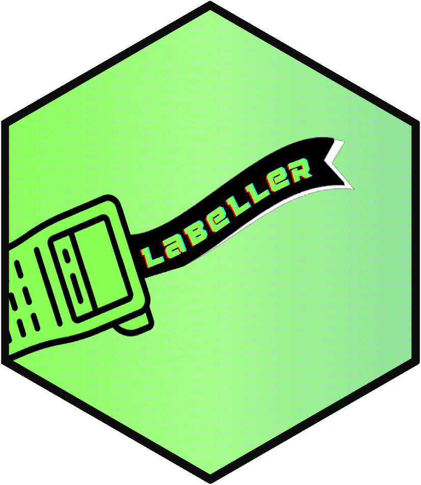

# `labeller` 

<!-- badges: start -->
[](https://lifecycle.r-lib.org/articles/stages.html#experimental)
<!-- badges: end -->

The goal of labeller is find, fix, an double-check common issues that arise when documenting data. This package is useful wherever variable and value labels are found, but particularly useful where those labels have been generated by [Survey Solutions](https://mysurvey.solutions/).

##  Installation

This package is not yet available on SSC, but can be installed from GitHub with the following commands.

To get the latest stable version, run the following two commands:

```
local tag "main"
net install labeller, ///
  from("https://raw.githubusercontent.com/lsms-worldbank/labeller/`tag'/src")
```

To target a particular release, set `tag` to your target release:

```
local tag "v1.0"
net install labeller, ///
  from("https://raw.githubusercontent.com/lsms-worldbank/labeller/`tag'/src")
```

Note also: while this package does not require [selector](https://github.com/lsms-worldbank/selector), some commands in labeller do leverage the questionnaire metadata that selector adds to survey metadata. 

## Usage

More details on 

- [What](#what) objects labeller manages
- [How](#how) it manages those objects

### What

- [Variable labels](#variable-labels)
- [Value labels](#value-labels)

#### Variable labels

```
* missing
lbl_list_no_varlbl

* too long
lbl_list_long_varlbl, maxlen(80)

* contains text...
* ... SuSo pipes
lbl_list_pipes
* ... some text
lbl_matches_vars "string to find"
```

#### Value labels

```
* unused
lbl_list_unused_lbls, verbose

* too long
lbl_list_long_vallbl, max(100)

* contains text
* for example, French characters
lbl_list_matching_vals, pattern("[àâäÀÂÄéèêëÉÈÊËîïôöÔÖùûüçÇ]")
```

## How

Provides functions for the full data documentation workflow:

- [List](#list) problems
- [Fix](#fix) them
- [Assert](#assert) everything has been addressed

### List

Step 1: Take stock of the problem's scope

```
* list all pipes and all variables with those pipes
lbl_list_pipe
```

### Fix

Step 2: Treat problems where they appear

```
* replace "%rostertitle% with "[NAME]" in all variable labels
lbl_replace_pipe, ///
  pipe("%rostertitle%") ///
  replacement("[NAME]")
```

### Assert

Step 3: Confirm that all problems have been resolved

```
lbl_assert_no_pipes
```

## Learn more

To learn more about the package:

- Consult the reference documentation
- Read how-to articles
